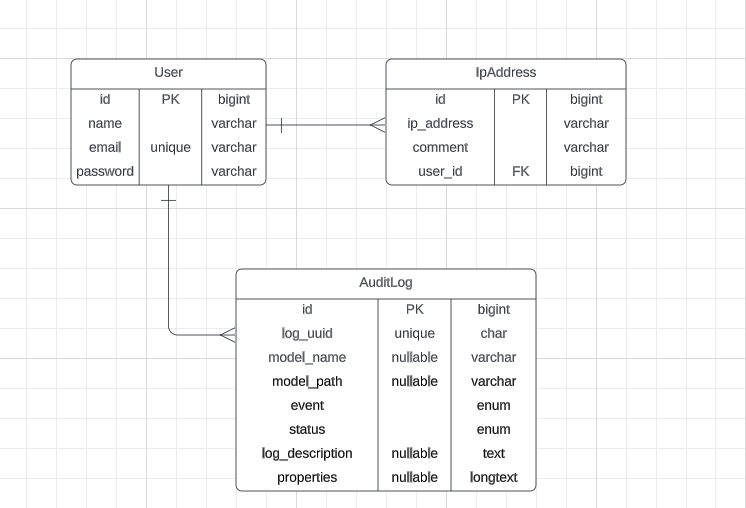

# Project Name - IP management

## About the project:
The project is to design and implement a web-based IP address management solution to allow us to record an IP address and comment on its assignment. For example, we might create an entry for 202.92.249.111, and label it gifts.ad-group.com.au. Or we might label it ‘Spare’, or ‘BFBC2 Server’. 

The objective is to build a simple web application to provide this functionality using the following requirements.

## Requirements:
- Log in to the system and receive an authenticated token, with all subsequent steps requiring this authenticated token.
- Add a new IP address to the database and attach a small label/comment to it.
- Modify an IP address to change the label.
- View an audit log of which changes have been made.
- The database should record all IP addresses, associated comments/labels, and an audit trail of any additions or changes to the database.
- Adds/changes should be not allowed if users are not authenticated.
- An audit trail should be maintained for every login, addition or change
- IP addresses must be validated as acceptable before being entered into the database
- The system should easily support the addition of new capabilities in the future with minimal effort.

## Project Installation

### Prerequisite
- Docker Desktop and Docker compose. Install guide: [Docker Desktop](https://docs.docker.com/desktop/)
- In your host file it might required to add localhost with 127.0.0.1 ip `(127.0.0.1       localhost)`
- The backend application will run in 80 port and the frontend will run in 3000 port and database will run in 3306 port. So please make sure these ports are not busy with other application in your local machine.

### Installation
- Clone the repository (`https://github.com/salihanmridha/ip-management.git`) in your project directory.
- Navigate by your command prompt to the project directory where docker-compose.yml file exist.
- RUN `docker-compose build && docker-compose up -d` command.
- This command will create the containers and install the project and run all necessary commands like: composer install, migration, seeder, npm install, npm start etc.
- If you want to run the applications in different port then please update docker-compose.yml, backend/Dockerfile, frontend/Dockerfile, nginx/default.conf files accordingly. And you might also needed to update .env file if your application running domain is not http://localhost
- Now Ready to go. Go to browser and run the application with http://localhost:3000
- And if you want to run the api, you should go with http://localhost/api

## How to use the application

The application has 2 part. Backend API with Laravel and Frontend with React JS. For backend api I've created swagger api documentation which will help you to understand backend api part more easily. For each endpoint you will get the information what request you need to send and what response you will get.

### Swagger API documentation
You will find swagger API documentation on YOUR_URL/api/documentation. For me it is: http://localhost/api/documentation. 

Your might be:
`http://localhost:8000/api/documentation` or `http://127.0.0.1:8000/api/documentation`

If you want to change server url of swagger then please go to `.env` file and change the value of these variables:

`L5_SWAGGER_CONST_HOST=http://localhost/api/`

`L5_SWAGGER_CONST_HOST_COMMON=http://localhost:8000/api/`

`L5_SWAGGER_CONST_HOST_COMMON_IP=http://127.0.0.1:8000/api/`

### Backend

#### Authentication
- For authentication token I've used sanctum.
- You'll find details documentation and how to use the authentication [here](http://localhost/api/documentation#/Authentication/loginUser) or YOUR_URL/api/documentation#/Authentication/loginUser.

###### Default User
user email: salihanmridha@gmail.com

password: 12345678

#### IP Address CRU Feature
- All ip address CRU routes are protected with auth:sanctum middleware, so you required to authenticate first, before you do any operation.
- You'll find details documentation and how to use the Ip address CRU feature [here](http://localhost/api/documentation#/IpAddress)

#### Audit Log
- You'll find details documentation and how to use the Audit log feature [here](http://localhost/api/documentation#/AuditLog)

### Exception handling
For handling any exception, I've used `Handler.php` file. There I added most common scenarios to handle exception. All the exception will return a standard json format data with error messages.

## Architecture and Design Pattern
I have chosen to use Service layer, Repository, Observer and Event service design pattern in my implementation of the IP management API project.

### Service layer 
The Service Layer pattern provides a clear separation of concerns between the presentation layer (i.e., the controllers and routes) and the data access layer (i.e., the repositories). The Service Layer acts as an intermediary between the two layers, encapsulating the business logic and exposing a simplified API to the presentation layer. This pattern helps improve code maintainability and testability, as well as promoting code reuse and modularity.

### Repository
The Repository pattern provides a consistent and uniform way to access and manipulate data from data sources, such as a database. The Repository acts as a collection of data access methods, abstracting the underlying data store and providing a simple and consistent interface to the Service Layer. This pattern helps decouple the application from specific data storage technologies, which can be easily swapped out or modified without affecting the rest of the codebase.

### Observer
The Observer Pattern is a behavioral design pattern that defines a one-to-many dependency between objects, ensuring that when one object changes its state, all its dependents are notified and updated automatically. It's commonly used in event handling systems, where an object, known as the subject, maintains a list of its dependents, called observers, and notifies them of any state changes.

### Event service
The Event Service Provider pattern is pivotal for handling diverse application events while maintaining clean and modular code. It decouples event triggering and handling, enhancing flexibility.

Together, all of these patterns provide a solid foundation for building a scalable, maintainable, and testable API that can evolve over time as business needs change.

### ERD - (Entity relationship diagram)

## Test cases
I have written total 16 test cases to ensure the api functionality is working correctly. I've skipped user test cases and I think during ip address and audit log test case, authentication is covered.

To run test cases, you need to run get access in docker php container.

- RUN `docker-compose exec -it backend /bin/sh` or `docker exec -it ip-management-backend /bin/sh`
- Now you should have access to the backend container instance and you'll be in /var/www/html directory.
- RUN `php artisan test`
- All test cases will run and will show you result.

#### List of test cases

PASS  Tests\Feature\AuditLogTest

✓ unauthenticated user cant get audit log list                                                                                              
✓ authenticated user can get audit log list                                                                                                  
✓ audit log create on success login                                                                                                          
✓ audit log create on failed login                                                                                                          
✓ audit log create on ip create event                                                                                                       
✓ audit log create on ip update event                                                                                                       

PASS  Tests\Feature\IpAddressTest

✓ unauthenticated user cant get ip list                                                                                                      
✓ unauthenticated user cant create ip                                                                                                        
✓ unauthenticated user cant get single ip address                                                                                            
✓ unauthenticated user cant update ip                                                                                                        
✓ authenticated user can create ip                                                                                                           
✓ authenticated user cant create ip with invalid ip

✓ authenticated user cant create ip without fill ip field                                                                                   
✓ authenticated user cant create ip without fill comment field                                                                              
✓ authenticated user can update ip comment                                                                                                   
✓ authenticated user cant update ip comment without comment field                                                                           

Tests:    16 passed (33 assertions)

#Contact

Salihan Mridha

[salihanmridha@gmail.com](mailto:salihanmridha@gmail.com)